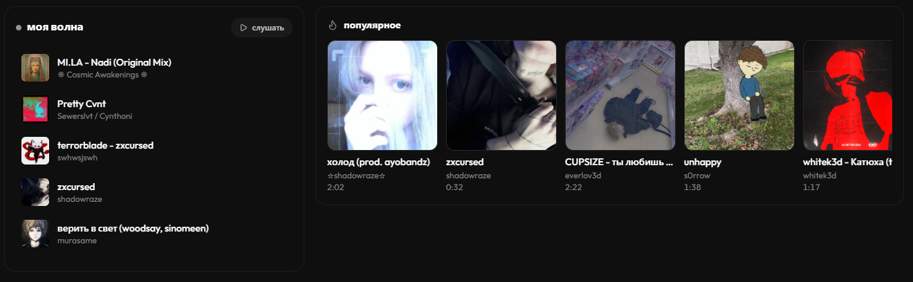
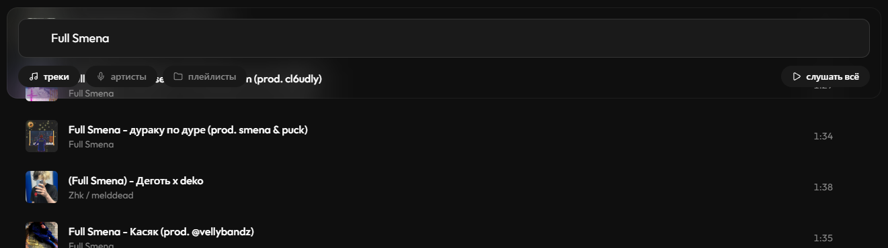
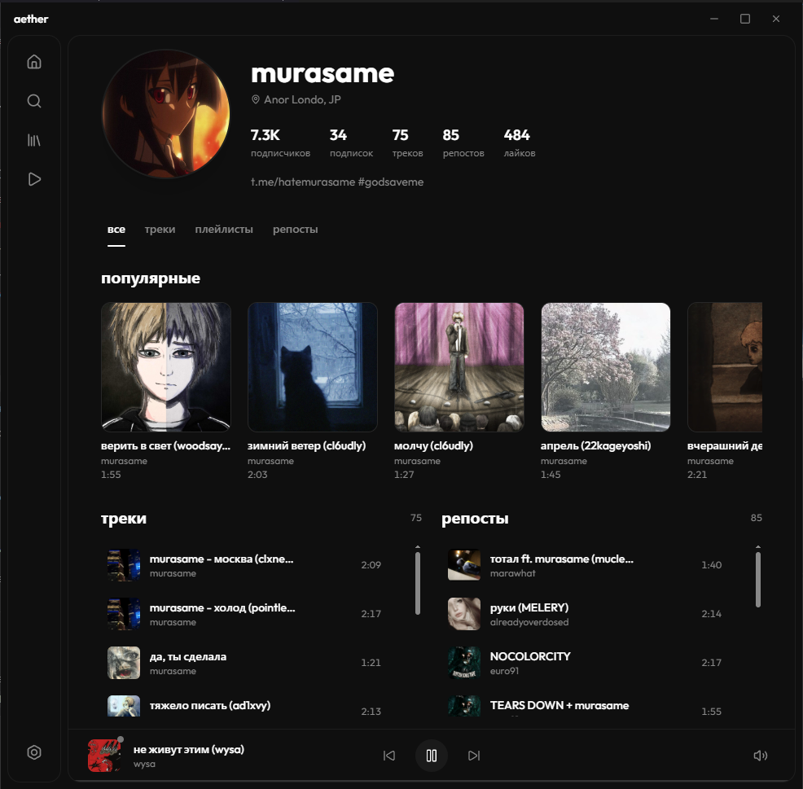
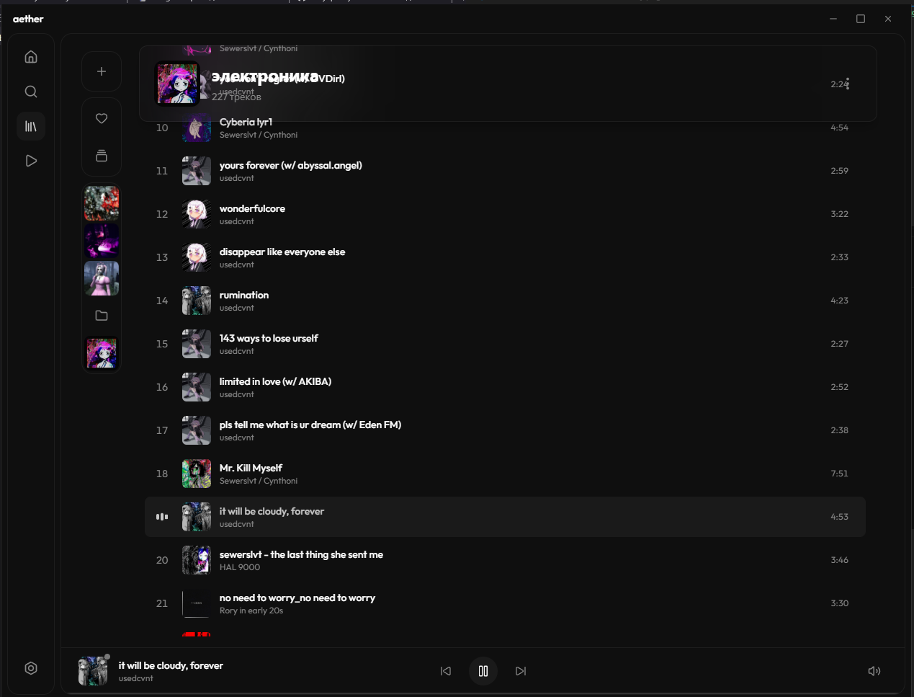
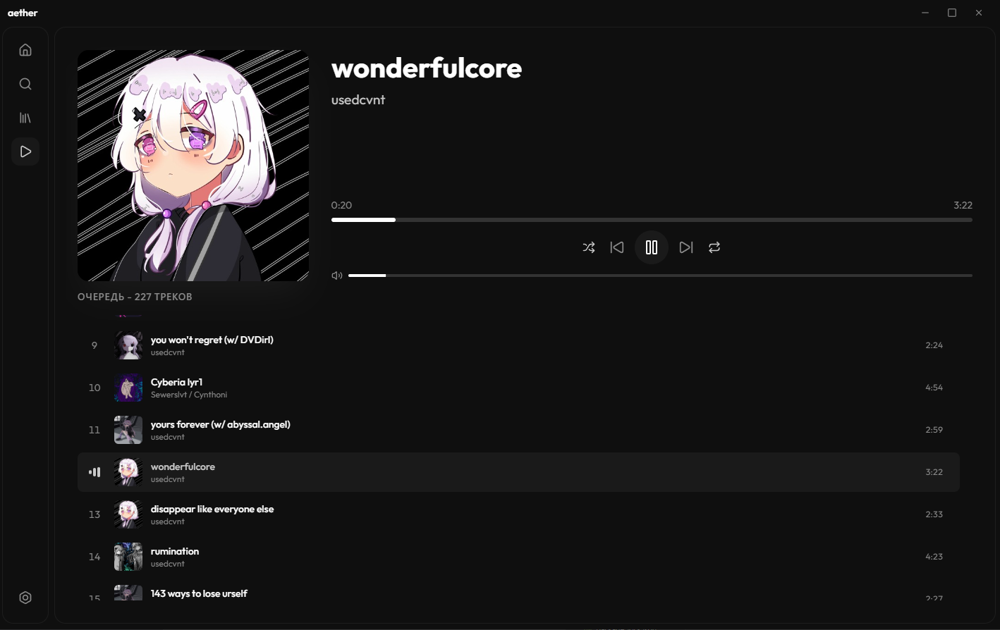

<div align="center">


<h1>aether</h1>

<b>десктопный музыкальный плеер для SoundCloud</b>

<sub>без рекламы · без капчи · без цензуры · доступно в россии</sub>

<br>
<br>

<a href="https://github.com/whyspurky/aether-react/blob/main/LICENSE">

</a>

<br>

<a href="https://t.me/aether_player">

</a>
<a href="https://github.com/whyspurky/aether-react/releases/latest">

</a>

</div>

---

<div align="center">



</div>

---

## что это

**aether** это полноценное десктопное приложение для прослушивания музыки на SoundCloud

написано на **Tauri 2** + **React 18** — работает нативно, потребляет минимум ресурсов и не тормозит

---

## почему aether

<table>
<tr>
<td width="50%" valign="top">

### доступно в россии

soundcloud заблокирован провайдерами — веб версия не открывается

aether работает напрямую благодаря встроенному **zapret** или **своему прокси**

### никакой рекламы

ноль баннеров, ноль промо вставок между треками, ноль всплывающих окон

чистый интерфейс | только музыка

### без капчи

никаких проверок я не робот

открыл — слушаешь

</td>
<td width="50%" valign="top">

### нативное и лёгкое

построено на **tauri 2** на rust вместо electron

- размер установщика **3-6 мегабайт**
- память **200-300 мегабайт**
- мгновенный запуск
- плавный интерфейс на 60 fps

### стриминг в лучшем качестве

1. **aac 160**
2. **aac 96**
3. **mp3 hls**
4. **mp3**

максимум без подписки go plus

</td>
</tr>
</table>

---

## возможности

<div align="center">



</div>

### музыка

- поиск треков, артистов, плейлистов
- популярное и моя волна
- страницы артистов с табами
- страницы плейлистов и альбомов
- библиотека: избранное, история, свои плейлисты
- импорт плейлистов из саундклауда

### плеер

- очередь с автодогрузкой
- шафл и репит
- сохранение позиции и очереди между запусками
- предзагрузка следующего трека
- стриминг в aac 160 hls

### обход блокировок

- встроенный **zapret** с автоскачиванием
- личный прокси socks5, http, https

---

<div align="center">



</div>

---

## скачать

<div align="center">

<a href="https://github.com/whyspurky/aether-react/releases/latest">

</a>

</div>

перейди на [страницу релизов](https://github.com/whyspurky/aether-react/releases/latest) и скачай

- **exe** (nsis установщик) — рекомендуется
- **msi** — альтернативный установщик

**требования** windows 10 версии 1809 или выше, windows 11

---

## обход блокировок

работает в регионах где саундклауд заблокирован

встроенный **zapret** скачивается одной кнопкой в настройках

альтернатива свой **socks5** или **http** прокси

подробнее в [документации](./docs)

---

<div align="center">



</div>

---

## обратная связь

| | |
| сообщество | [telegram канал](https://t.me/aether_player) |
| баги | [github issues](https://github.com/whyspurky/aether-react/issues) |
| звезда | [github stars](https://github.com/whyspurky/aether-react/stargazers) |

pull requests приветствуются

для крупных изменений сначала открой issue

---

## сборка из исходников

<details>
<summary><b>инструкция для разработчиков</b></summary>

### требования

- node js 18+
- rust 1.75+

### запуск

```bash
git clone https://github.com/whyspurky/aether-react.git
cd aether-react
npm install
npm run tauri dev

### production сборка

```bash
npm run tauri build
```

артефакты появятся в `src-tauri/target/release/bundle/`

### проверки

```bash
npx tsc --noEmit        
cargo check             
```

</details>

---

<table>
<td width="30%" valign="top">

## стек

| компонент | технология |
| :--- | :--- |
| оболочка | tauri 2 на rust |
| фронт | react 18, vite 5, tailwind css 3 |
| стейт | zustand |
| роутинг | react router 6 |
| аудио | rodio на rust |
| иконки | lucide |
| анимации | css keyframes |

</td>
<td width="70%" valign="top">



</td>
</table>

---

## лицензия

MIT | подробности в файле [LICENSE](./LICENSE)

soundcloud это торговая марка soundcloud ltd | это приложение не аффилировано с soundcloud

---

<div align="center">

### дисклеймер

неофициальный клиент

не связан с soundcloud

все права на музыку принадлежат исполнителям и правообладателям

</div>

---

<p align="center">
<code>soundcloud клиент</code> · <code>soundcloud для пк</code> · <code>soundcloud windows</code> · <code>soundcloud без рекламы</code> · <code>soundcloud россия</code> · <code>soundcloud в россии</code> · <code>soundcloud не открывается</code> · <code>soundcloud заблокирован</code> · <code>soundcloud blocked russia</code> · <code>soundcloud desktop app</code> · <code>soundcloud desktop client</code> · <code>soundcloud player</code> · <code>soundcloud без капчи</code> · <code>скачать soundcloud на компьютер</code> · <code>soundcloud desktop download</code> · <code>soundcloud alternative client</code> · <code>soundcloud no ads</code> · <code>музыкальный плеер soundcloud</code> · <code>aether music player</code>
</p>

<p align="center">
<a href="https://github.com/whyspurky/aether-react/releases/latest">

</a>
</p>