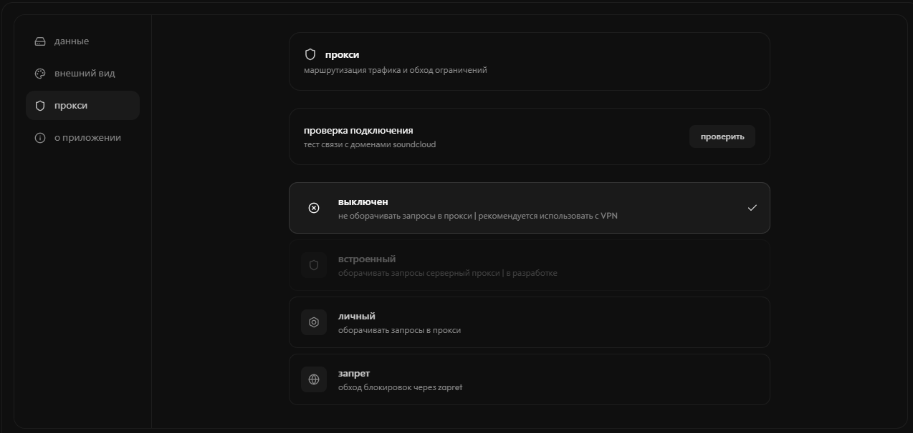

<div align="center">

# aether

десктопный музыкальный плеер для soundcloud

tauri 2 · react 18 · rust

[](https://t.me/aether_player)

</div>

---

## скриншоты

<div align="center">

| главная | поиск |
| :---: | :---: |
|  |  |

| артист | плеер |
| :---: | :---: |
|  |  |

| библиотека | настройки |
| :---: | :---: |
|  |  |

</div>

---

## возможности

### музыка

- поиск треков, артистов, плейлистов
- популярное и моя волна
- страницы артистов с табами
- страницы плейлистов и альбомов
- библиотека: избранное, история, свои плейлисты
- импорт плейлистов из soundcloud

### плеер

- очередь с автодогрузкой
- shuffle и repeat
- сохранение позиции и очереди между запусками
- медиа клавиши
- предзагрузка следующего трека
- стриминг в aac 160 hls

### обход блокировок

- встроенный zapret с автоскачиванием
- личный прокси socks5, http, https

---

## стек

*фронт* react 18, typescript, tailwind, zustand, vite

*бэк* tauri 2, rust, rodio, reqwest

---

## сборка

npm install
npm run tauri dev      # разработка
npm run tauri build    # релиз

обход блокировок

работает в регионах где soundcloud заблокирован

встроенный zapret скачивается одной кнопкой в настройках

альтернатива свой socks5 или http прокси

подробнее в документации
сообщество

телеграм канал с обновлениями t.me/aether_player
лицензия

MIT
<div align="center">
дисклеймер

неофициальный клиент

не связан с soundcloud

все права на музыку принадлежат исполнителям и правообладателям
</div> ```